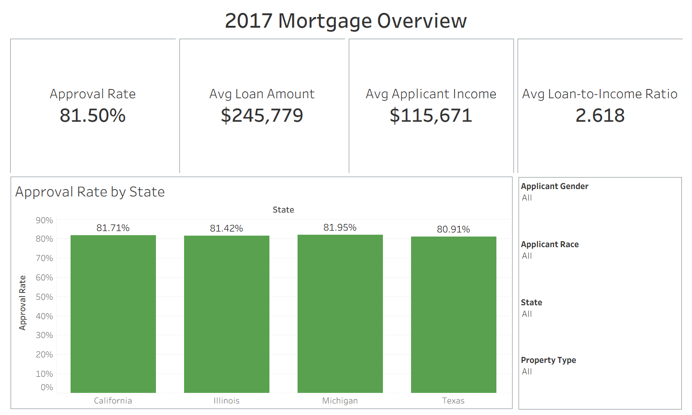
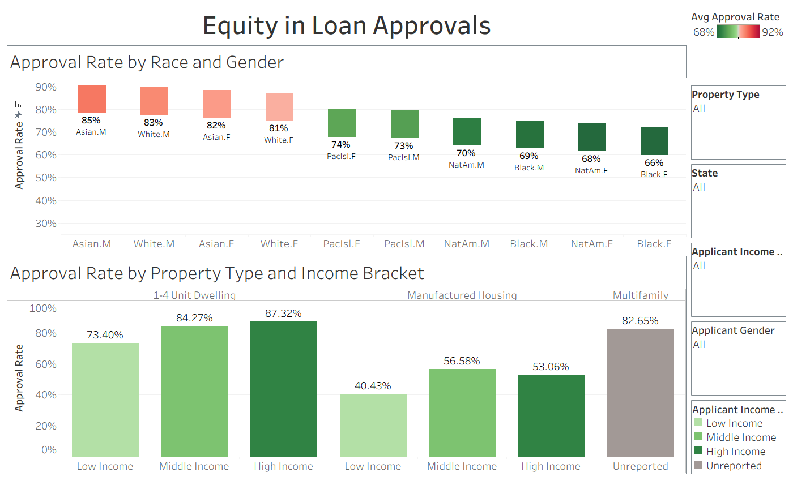
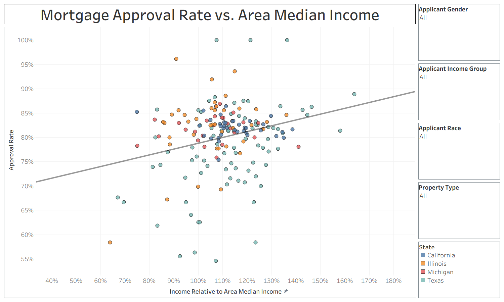

# Mortgage Approval Analytics

## Executive Summary

This project analyzes mortgage application outcomes using 2017 Home Mortgage Disclosure Act data across California, Illinois, Michigan, and Texas. I used Python and Excel Power Query to prepare a 205,000+ record analytical dataset, then built Tableau dashboards to compare approval patterns across geography, applicant characteristics, income measures, and property types.

The goal was not to predict individual mortgage decisions or prove causality. The goal was to identify visible approval rate patterns and create an interactive analysis that could help lenders, analysts, policymakers, or researchers decide where deeper review may be warranted.

## Business Question

How do favorable mortgage application decisions vary across applicant, financial, geographic, and property characteristics in selected 2017 HMDA records?

## Tools Used

* Python
* Excel Power Query
* Tableau
* Excel
* PowerPoint

## Data

This project uses public 2017 HMDA mortgage application data from CFPB and FFIEC sources. The analysis focuses on four states: California, Illinois, Michigan, and Texas.

The final analytical dataset contains more than 205,000 mortgage application records after cleaning, filtering, recoding, and combining state level data.

Raw data files are not stored directly in this repository because of file size and reproducibility considerations. Data source instructions and field definitions are documented in the `data/README.md` file.

## Workflow

1. Collected state level HMDA mortgage application files.
2. Used Python during the initial preparation stage.
3. Used Excel Power Query to clean, recode, filter, and combine state level data.
4. Created analysis fields for approval status, applicant income groups, loan to income ratios, and demographic segments.
5. Built three Tableau dashboards to compare approval patterns across states, income measures, demographic groups, and property types.
6. Communicated findings through a written report and presentation.

## Key Results

* The final dataset included more than 205,000 mortgage application records.
* The dashboards identified an 18.6 percentage point approval rate spread across race gender groups.
* Manufactured housing applications had substantially lower approval rates than 1 to 4 unit property applications.
* Similar top line approval rates across states concealed larger differences across applicant groups, income measures, and property types.

## Visuals

### Dashboard 1: Mortgage Overview

Provides a high-level summary of the mortgage application dataset, including overall approval rate, average loan amount, applicant income, loan-to-income ratio, and approval rates by state. Interactive filters allow users to compare results across applicant demographics and property types.

---

### Dashboard 2: Applicant and Property Analysis

Explores how approval rates vary across race-gender groups, applicant income groups, and property types. The dashboard highlights meaningful differences between applicant segments while remaining descriptive rather than causal.

---

### Dashboard 3: Income Relative to Area

Examines the relationship between applicant income relative to area median income and mortgage approval rates. A trend line helps visualize the overall relationship while interactive filters allow comparisons across states, demographics, and property types.

## Limitations

This is a descriptive analytics project. It identifies patterns in mortgage application outcomes but does not prove why those differences occurred.

Important limitations:

* The analysis does not include every factor used in mortgage underwriting.
* Approval differences should not be interpreted as proof of discrimination or causation.
* The selected states are not a statistically representative sample of the entire United States.
* Some variables describe census tract context rather than individual applicant characteristics.

## Reproducibility

This repository will include the cleaned project workflow, data source instructions, package requirements, and notebook outputs needed to understand or rebuild the analysis.

## Personal Contribution

I completed the data preparation, Power Query transformation workflow, Tableau dashboard development, written analysis, and presentation for this project.
