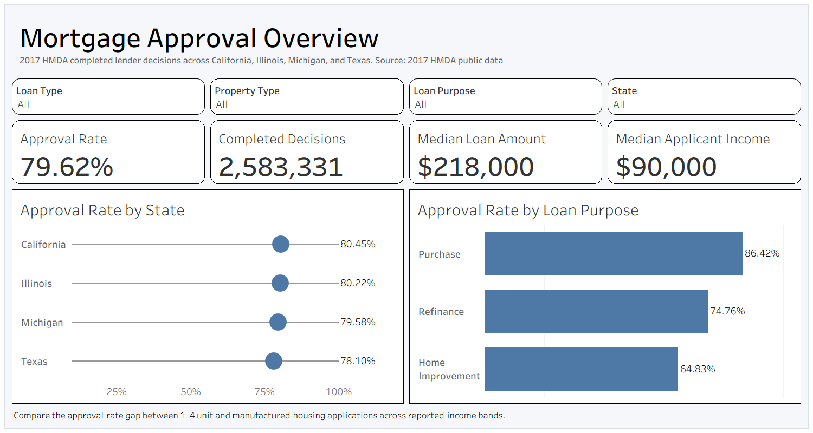
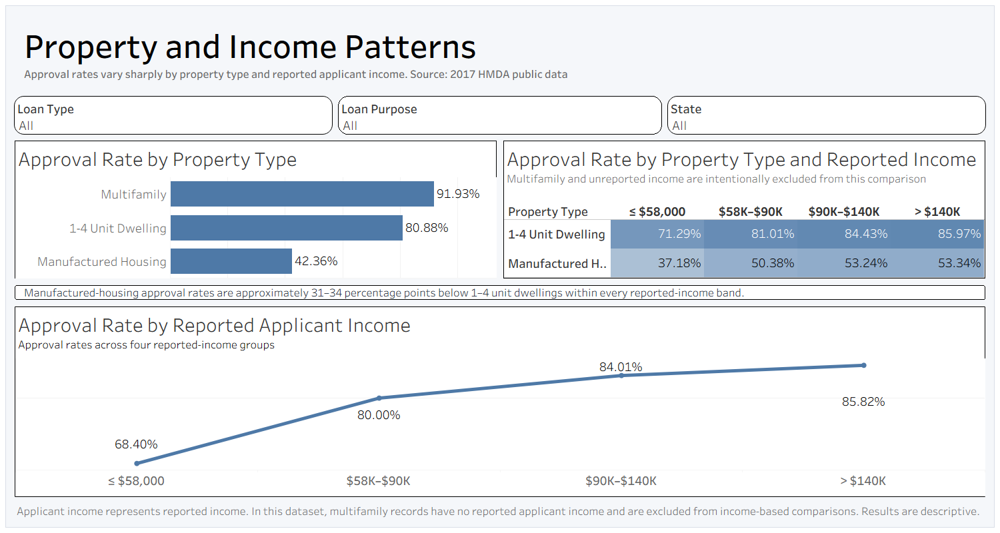
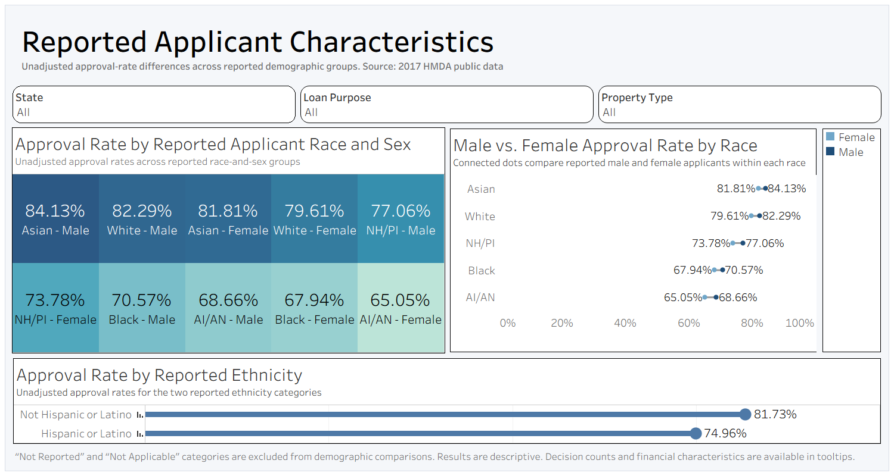

# Mortgage Approval Analytics

An end-to-end analysis of 2017 Home Mortgage Disclosure Act data across California, Illinois, Michigan, and Texas.

Using Python, DuckDB, SQL, and Tableau, this project processes 3.8 million raw mortgage application records into a validated analytical dataset of 2.58 million completed lender decisions. The final Tableau Public workbook explores approval patterns across states, property types, loan purposes, reported applicant income, and reported applicant characteristics.

## Interactive Dashboard

[View the interactive Tableau Public workbook](https://public.tableau.com/views/MortgageApprovalAnalytics2017HMDA/MortgageMarketOverview?:language=en-US&:sid=&:display_count=n&:origin=viz_share_link)

The workbook contains three dashboards:

1. Mortgage Market Overview
2. Property Income Patterns
3. Reported Applicant Characteristics

## Dashboard Previews

### Mortgage Market Overview



Provides an overall view of approval rates, completed decisions, median loan amounts, median reported applicant income, state-level outcomes, and loan-purpose comparisons.

### Property Income Patterns



Examines approval-rate differences across property types and reported applicant-income groups, including comparisons between 1–4 unit dwellings and manufactured housing.

### Reported Applicant Characteristics



Displays descriptive, unadjusted approval-rate differences across reported race, sex, and ethnicity categories.

## Project Objective

The project investigates the following question:

> How did mortgage approval rates differ across states, property types, loan purposes, reported applicant-income groups, and reported applicant characteristics within completed 2017 HMDA lender decisions?

The goal was to transform a large and difficult-to-use public dataset into a reproducible analytical pipeline and an accessible interactive dashboard.

This is a descriptive analysis. It is not a predictive underwriting model, causal study, or fair-lending determination.

## Project Highlights

- Processed **3,802,357 raw HMDA records**
- Analyzed approximately **2.8 GB of CSV data**
- Combined full datasets from **California, Illinois, Michigan, and Texas**
- Built a reproducible pipeline using **Python, DuckDB, and SQL**
- Produced a final table containing **2,583,331 completed lender decisions**
- Exported a streamlined **25-field Tableau-ready dataset**
- Created and published **three interactive Tableau dashboards**
- Added validation checks for schemas, row counts, missing values, and numeric ranges
- Documented missing-data limitations and avoided unsupported causal conclusions

## Tools

- **Python** — pipeline orchestration, validation, and export
- **DuckDB** — local analytical database and large-file processing
- **SQL** — transformation, feature engineering, validation, and analysis
- **Tableau Public** — interactive dashboard development and publication
- **Git and GitHub** — version control and project documentation

## Data Scope

The analysis uses public 2017 HMDA data from four states.

| State | Raw Records | Completed Decisions | Approval Rate |
|---|---:|---:|---:|
| California | 1,714,459 | 1,157,546 | 80.45% |
| Illinois | 502,511 | 344,864 | 80.22% |
| Michigan | 437,181 | 319,222 | 79.58% |
| Texas | 1,148,206 | 761,699 | 78.10% |
| **Total** | **3,802,357** | **2,583,331** | **79.62%** |

Each raw state file originally contained 78 fields.

Large source files, generated databases, Tableau extracts, and processed exports are excluded from GitHub because they are reproducible and too large for normal repository storage.

## Approval Definition

The analytical dataset includes completed lender decisions represented by HMDA action codes:

- **1:** Loan originated
- **2:** Application approved but not accepted
- **3:** Application denied

The following records are excluded:

- Withdrawn applications
- Incomplete applications
- Purchased loans
- Preapproval records

A binary approval indicator was created:

- `1` = originated or approved but not accepted
- `0` = denied

Therefore:

- `AVG(Approval Indicator)` represents the approval rate
- `SUM(Approval Indicator)` represents approved decisions
- `COUNT(Approval Indicator)` represents completed decisions

The completed-decision dataset contains:

| Outcome | Records |
|---|---:|
| Loans originated | 1,944,680 |
| Approved but not accepted | 112,182 |
| Denied | 526,469 |
| **Total completed decisions** | **2,583,331** |

## Data Pipeline

The project follows this workflow:

```text
Raw 2017 HMDA CSV files
        ↓
Schema and row-count validation
        ↓
DuckDB SQL transformation pipeline
        ↓
Clean analytical table
        ↓
SQL analysis and validation
        ↓
Tableau-ready CSV export
        ↓
Interactive Tableau Public dashboards